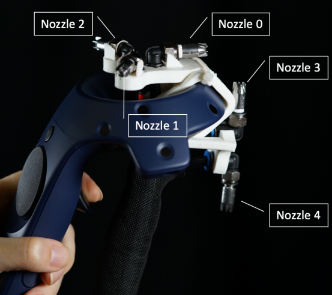
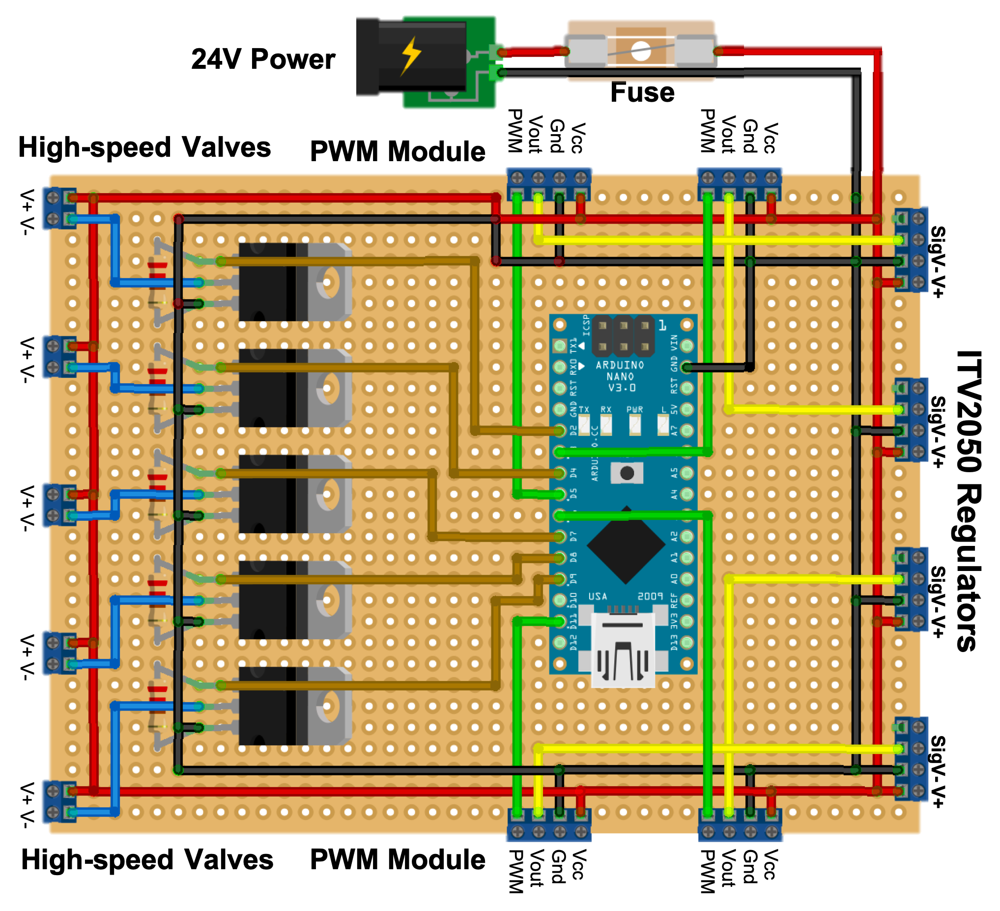

# Nozzle Definition



# Circuit Board



# BibTeX 

## BibTeX for JetController CHI'21 Full Paper
```
@inproceedings{10.1145/3411764.3445549,
	author = {Wang, Yu-Wei and Lin, Yu-Hsin and Ku, Pin-Sung and Miyatake, Y\={o}ko and Mao, Yi-Hsuan and Chen, Po Yu and Tseng, Chun-Miao and Chen, Mike Y.},
	title = {JetController: High-Speed Ungrounded 3-DoF Force Feedback Controllers Using Air Propulsion Jets},
	year = {2021},
	isbn = {9781450380966},
	publisher = {Association for Computing Machinery},
	address = {New York, NY, USA},
	url = {https://doi.org/10.1145/3411764.3445549},
	doi = {10.1145/3411764.3445549},
	abstract = {JetController is a novel haptic technology capable of supporting high-speed and persistent 3-DoF ungrounded force feedback. It uses high-speed pneumatic solenoid valves to modulate compressed air to achieve 20-50Hz of full impulses at 4.0-1.0N, and combines multiple air propulsion jets to generate 3-DoF force feedback. Compared to propeller-based approaches, JetController supports 10-30 times faster impulse frequency, and its handheld device is significantly lighter and more compact. JetController supports a wide range of haptic events in games and VR experiences, from firing automatic weapons in games like Halo (15Hz) to slicing fruits in Fruit Ninja (up to 45Hz). To evaluate JetController, we integrated our prototype with two popular VR games, Half-life: Alyx and Beat Saber, to support a variety of 3D interactions. Study results showed that JetController significantly improved realism, enjoyment, and overall experience compared to commercial vibrating controllers, and was preferred by most participants. },
	booktitle = {Proceedings of the 2021 CHI Conference on Human Factors in Computing Systems},
	articleno = {124},
	numpages = {12},
	keywords = {ungrounded force feedback., air propulsion, High-speed haptic feedback},
	location = {Yokohama, Japan},
	series = {CHI '21}
}
```

## BibTeX for JetController CHI'21 Interactivity
```
@inproceedings{10.1145/3411763.3451542,
	author = {Wang, Yu-Wei and Lin, Yu-Hsin and Ku, Pin-Sung and Miyatake, Y\={o}ko and Chen, Po-Yu and Tseng, Chun-Miao and Tsai, Ching-Yi and Chen, Mike Y.},
	title = {Demonstration of JetController: High-Speed Ungrounded Force Feedback Controllers Using Air Propulsion Jets},
	year = {2021},
	isbn = {9781450380959},
	publisher = {Association for Computing Machinery},
	address = {New York, NY, USA},
	url = {https://doi.org/10.1145/3411763.3451542},
	doi = {10.1145/3411763.3451542},
	abstract = {JetController is a novel haptic technology capable of supporting high-speed and persistent 3-DoF ungrounded force feedback. It uses high-speed pneumatic solenoid valves to modulate compressed air to achieve 20-50Hz of full impulses at 4.0-1.0N and combines multiple air propulsion jets to generate 3-DoF force feedback. Compared to propeller-based approaches, JetController is more than 10 times faster in impulse frequency, and its handheld device is significantly lighter and more compact. JetController supports a wide range of haptic events in games and VR experiences, from firing automatic weapons in games like Halo to cutting fruits in Fruit Ninja. To discuss the differences between JetController and vibrotactile feedback approaches, we designed a new prototype based on PS5 Controller, DualSense&nbsp;[1]. There are three haptic approaches in our demonstration, JetController, Adaptive Trigger, and regular vibration feedback. We provide two scenarios, driving with tactile (surface texture) feedback and shooting with recoil feedback. },
	booktitle = {Extended Abstracts of the 2021 CHI Conference on Human Factors in Computing Systems},
	articleno = {165},
	numpages = {4},
	keywords = {ungrounded force feedback., High-speed haptic feedback, air propulsion},
	location = {Yokohama, Japan},
	series = {CHI EA '21}
}
```

# Paper Links

CHI'21 Full Paper
[Author-Izer Service](https://dl.acm.org/doi/10.1145/3411764.3445549?cid=99659702103)
(You can obtain the camera-ready version from the ACM Digital Library at no charge via Author-Izer Service Link)

CHI'21 Interactivity
[Author-Izer Service](https://dl.acm.org/doi/10.1145/3411763.3451542?cid=99659702103)
(You can obtain the camera-ready version from the ACM Digital Library at no charge via Author-Izer Service Link)

Website of JetController
https://jetcontroller.org

Repository of Half-Life: Alyx Event Detector
https://github.com/Solla/HalfLifeAlyxEventDetector
